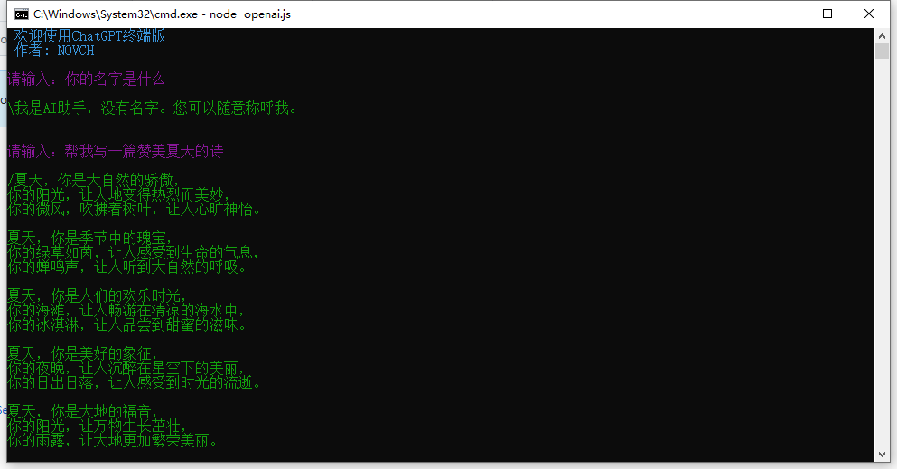

# ChatGPT终端版

## 安装

> 确保本身有安装Git和Nodejs 没安装的自行百度或询问ChatGPT  
> Node版本 >= 18.16.0 NPM版本 >= 9.5.1  
> 确保本身能够科学上网 需要全局科学上网  没有的请自行百度
> 将科学上网的端口设置为7890 也可以不改找到自己对应的端口修改config.js里的proxyPort字段

1. ` git clone https://github.com/NOVCHN/ChatGPT.git`
2. ` cd ChatGPT`
3. ` npm i `

## 使用

1. 在config里面填入自己的key
2. node openai.js
3. 开始与ChatGPT聊天吧

## 作者

> Author: NOVCH 

## 版本历史

> Date: 2023-05-12 

## 联系方式

> Email: me@novch.com 

## 示例图片

